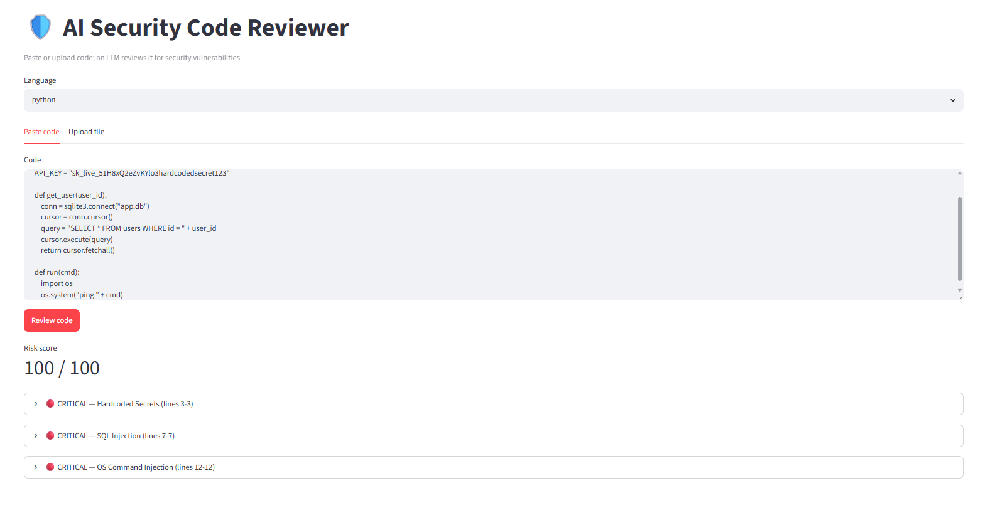
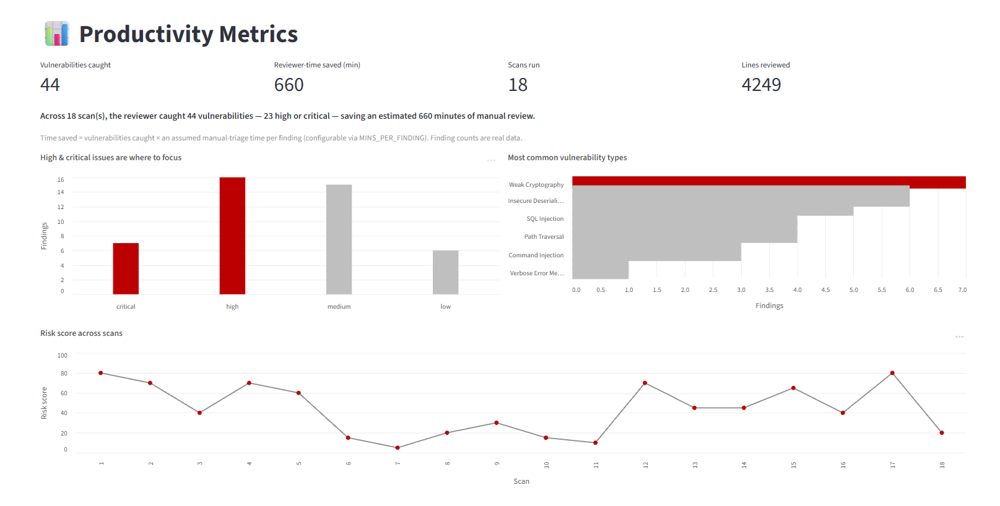

# Visa Security Code Reviewer

### Live Dashboard → _deploying — link added here after deployment_




**Paste or upload code and an LLM flags security vulnerabilities — severity-rated, each with a suggested fix — while a productivity dashboard quantifies the reviewer-time saved.**

---

This project models the work of Visa's Cybersecurity — Product Security Engineering team: hands-on generative AI, full-stack development (backend + APIs + frontend), infusing AI into engineering practices, and quantifying the productivity gain with metrics. A developer submits a snippet, an LLM reviews it for vulnerabilities (injection, hardcoded secrets, broken auth, and similar OWASP issues) and returns structured findings, every scan is persisted, and a metrics dashboard turns that history into a productivity story — vulnerabilities caught, reviewer-time saved, scan activity, and a risk trend.

## Job Posting

- **Role:** Software Engineer (Generative AI / Full-Stack) — Cybersecurity, Product Security Engineering
- **Company:** Visa Inc.

This project demonstrates the role's core deliverables: hands-on generative AI, full-stack development (backend, databases, API creation and consumption, frontend UI), infusing AI into engineering practices, test-driven development with CI, and showcasing the productivity improvement with metrics.

## Architecture

A FastAPI backend owns all logic — REST API, SQLAlchemy/MySQL persistence, and LLM orchestration. A Streamlit app is a thin client that consumes the API over HTTP. Detection is LLM-only: an engineered security prompt returns structured JSON findings validated with Pydantic.

```
Streamlit client  ──HTTP──>  FastAPI  ──>  Claude (claude-haiku-4-5)
                                  │
                                  └──> MySQL (scans + findings)
```

## Tech Stack

| Layer | Tool |
|---|---|
| Backend / API | FastAPI (auto Swagger docs at `/docs`) |
| LLM | Anthropic Claude (`claude-haiku-4-5`), LLM-only detection |
| Database | MySQL via SQLAlchemy (SQLite for tests/local) |
| Frontend | Streamlit (thin API client) |
| Visualisation | Altair (Storytelling with Data styling) |
| Testing | pytest (schemas, scoring, parser, API endpoints) |
| CI | GitHub Actions (pytest on every push) |

## API Endpoints

- `POST /scans` — submit code, returns scan + findings
- `GET /scans` / `GET /scans/{id}` — scan history
- `GET /metrics` — aggregated dashboard data
- `GET /health` — liveness

## Metrics

The dashboard reports vulnerabilities caught (by severity and type), scan activity, a risk trend, and **reviewer-time saved**. Time saved = real finding counts × one stated, configurable assumption (`MINS_PER_FINDING`).

## Running locally

1. `pip install -r requirements.txt`
2. Copy `.env.example` to `.env` and set `ANTHROPIC_API_KEY` (and `DATABASE_URL` for MySQL).
3. Backend: `uvicorn app.main:app --reload` (Swagger at http://localhost:8000/docs)
4. Frontend: `streamlit run streamlit_app/app.py`
5. *(Optional)* `python seed_data.py` — populate the dashboard with synthetic demo scans so the metrics charts have a realistic spread to show. Demo data only; real scans come from the Review page.

## Testing

`pytest -v` — runs against in-memory SQLite; no API key or DB server required (the Claude client and DB session are mocked/overridden).

## Known scope cuts / future work

- No authentication / multi-user (single-user demo)
- No GitHub PR integration (paste/upload only)
- Hybrid detection (static analysis + LLM), exportable reports, more languages
